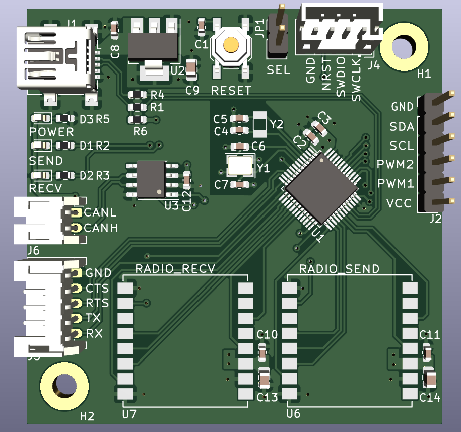
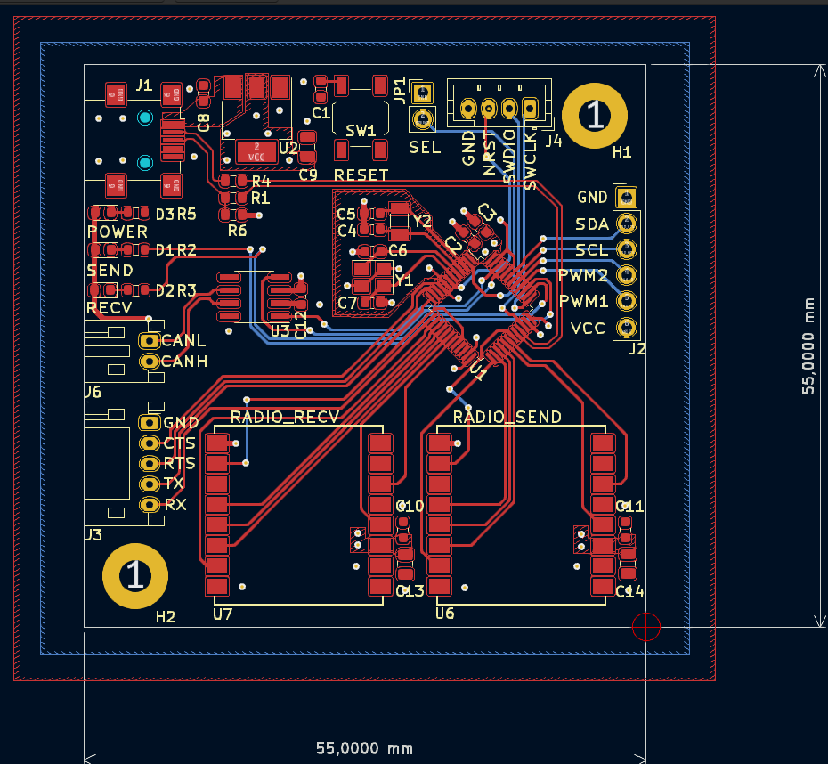

# Duplex SX126x Radio Module

Board with 2 radios, STM32 and USB or CAN

## Schematic

## Layout

## Notes
The STM32F103 can't it isn't possible to use both CAN and USB 
([Source](https://community.st.com/s/article/FAQ-Concurrent-use-of-USB-and-CAN-with-STM32F103))

The intended use is to switch the interface based on the state of the SEL pin during startup process. 

## Manufacture and Assembly
The generic components and the microcontroller were chosen based on JLCPCB's Basic Parts library. That includes only the STM32, CAN transceiver, LEDs, resistors, capacitors and crystals. All connectors and the main radio modules are not included. 

|                   |           |
|-------------------|-----------|
| PCB Manufacture   | $7.00     |
| PCB Assembly      | $27.62    |
| Shipping          | $10.17    |
| Total             | $44.79    |

For 5 boards. 

Since the conversion rate of USD to BRL is around R$5,00 the cost would be R$45,00 per board. Take note that the radio module costs around R$20 on aliexpress without shipping. 